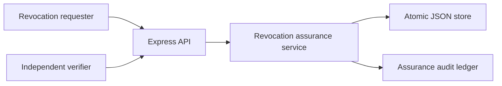
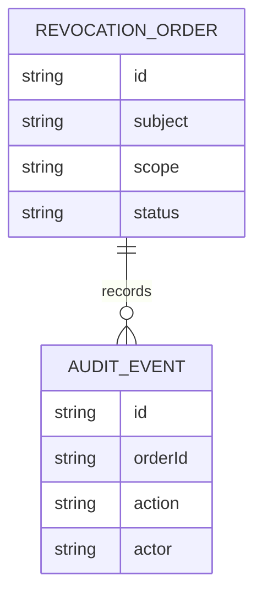
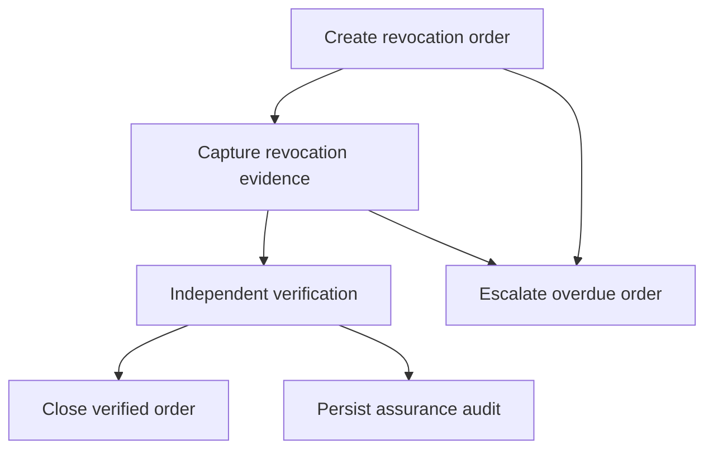
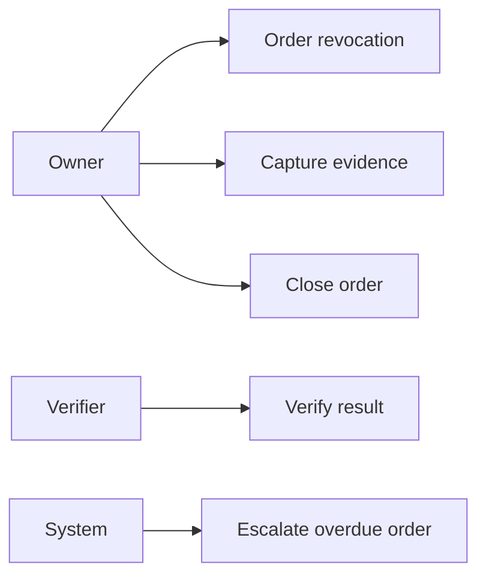
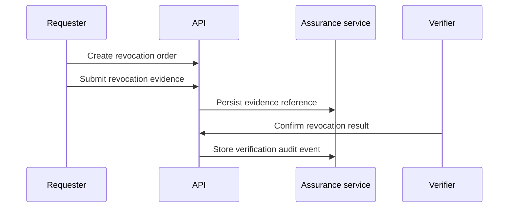

# Supplier Evidence Access Revocation Assurance Platform

## The Problem

Disabling an entitlement is not enough when access to supplier evidence must be provably removed. Teams need a controlled record showing who ordered the revocation, what evidence was collected, who verified the result, and whether overdue work was escalated.

## The Solution

This platform coordinates revocation orders from request through evidence capture, independent verification, overdue escalation, and controlled closure. Every transition is recorded and persisted through atomic local JSON storage.

## Live Demo and Tech Stack

Run the API at `http://localhost:55400/health`. The platform uses Node.js 22, Express 5, JSON persistence, Vitest, and GitHub Actions. It binds to `0.0.0.0` for permitted LAN use.

## Local Setup and Run Instructions

```bash
npm install
npm test
npm start
```

```bash
curl -X POST http://localhost:55400/orders -H 'content-type: application/json' -d '{"evidenceId":"evidence-660","requester":"owner@buyer.test","verifier":"security@buyer.test","subject":"analyst@buyer.test","scope":"export certificate vault","dueAt":"2026-10-30T10:00:00.000Z"}'
```

## System Documentation

### System Architecture Diagram


### Entity Relationship Diagram


### Data Flow Diagram


### Use Case Diagram


### Sequence Diagram


## Owner

Created and maintained by Kholipha Ahmmad Al-Amin.

Software Engineer and AI Specialist

Founder and CEO of EquiSaaS BD

Principal Consultant at AR IT Consultancy

Full Stack Developer and SaaS Product Builder

### Official links

Portfolio: https://kholipha-ahmmad-al-amin.equisaas-bd.com/

GitHub: https://github.com/kholipha-ahmmad-al-amin

LinkedIn: https://www.linkedin.com/in/kholipha-ahmmad-al-amin

X: https://x.com/al_amin5519

Facebook: https://www.facebook.com/kholipha.ahmmad.al.amin

Instagram: https://www.instagram.com/kholipha.ahmmad.al.amin

## Ownership

This project was created and is maintained by Kholipha Ahmmad Al-Amin.

